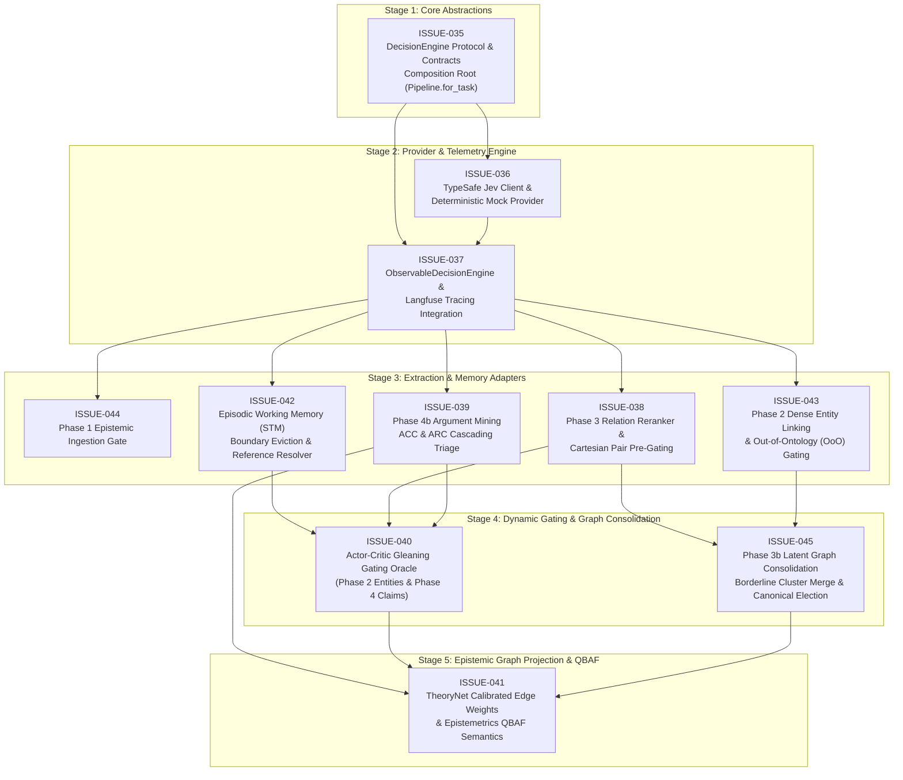

# TypeSafe Jev & Decision Engine Integration Initiative

This directory contains the engineering specifications, contract designs, component adapters, and implementation roadmap for integrating **TypeSafe Jev** and the **System 1 Decision Engine** architecture across the entire **Episteme** lifecycle (`episteme-pipeline`, `epistemetrics`, and `episteme-studio`).

---

## 1. Initiative Overview

Episteme is transitioning from a generative-monolith architecture to a **Dual-Process Neuro-Symbolic Pipeline** (Kahneman System 1 + System 2):
* **System 1 (TypeSafe Jev)**: High-throughput, sub-second ($70–500\text{ms}$), non-generative, typed classification, and calibrated decision gating over structured state blocks (`Choice`, `Score`, `Noul`).
* **System 2 (Generative LLMs)**: Deep contextual synthesis, open-ended conceptual reformulation, and multi-hop philosophical reasoning.

This architectural shift drastically reduces latency ($5\times–15\times$ speedup) and token burn ($60\%–85\%$ cost reduction), while replacing uncalibrated generative confidence guesses with mathematically grounded probabilities required by TheoryNet and Quaternary Bipolar Argumentation Frameworks (QBAF).

---

## 2. Issues Registry

| Issue ID | Title | Target Component(s) | Priority | Stage | Status |
| :--- | :--- | :--- | :--- | :--- | :--- |
| [**ISSUE-035**](ISSUE-035-core-decision-engine-architecture-and-contracts.md) | **Core Decision Engine Architecture, Contracts & Composition Root** | `pipeline/protocols/decision.py`, `pipeline/pipeline.py`, `pipeline/config.py` | High | Stage 1 | `Open` |
| [**ISSUE-036**](ISSUE-036-typesafe-jev-client-and-decision-adapter.md) | **TypeSafe Jev Client Implementation & System 1 Adapter** | `pipeline/decision/jev_client.py`, `pipeline/decision/mock.py` | High | Stage 2 | `Open` |
| [**ISSUE-037**](ISSUE-037-decision-observability-events-and-langfuse-tracing.md) | **Decision Engine Observability, Domain Events & Langfuse Tracing** | `pipeline/events/`, `pipeline/decision/observable.py` | Critical | Stage 2 | `Open` |
| [**ISSUE-038**](ISSUE-038-phase3-candidate-gating-and-relation-reranking.md) | **Phase 3 Candidate Pair Gating & Jev Relation Reranker** | `pipeline/phases/phase3_global_relations/`, `pipeline/config.py` | High | Stage 3 | `Open` |
| [**ISSUE-039**](ISSUE-039-phase4-argument-mining-acc-arc-triage.md) | **Phase 4b Argument Mining: Jev ACC & ARC Triage Classifiers** | `pipeline/phases/phase4_argument_mining/`, `pipeline/config.py` | High | Stage 3 | `Open` |
| [**ISSUE-040**](ISSUE-040-gleaning-and-extraction-stopping-gate.md) | **Objective Gleaning Gating via Jev Actor-Critic Stopping Oracle** | `pipeline/decision/gleaning.py`, `pipeline/phases/phase2/`, `pipeline/phases/phase4/` | Medium | Stage 4 | `Open` |
| [**ISSUE-041**](ISSUE-041-theorynet-calibrated-weights-and-qbaf-propagation.md) | **TheoryNet Projection & QBAF Calibrated Probability Propagation** | `pipeline/phases/phase6_theorynet/`, `epistemetrics/` | High | Stage 5 | `Open` |
| [**ISSUE-042**](ISSUE-042-episodic-working-memory-jev-state-machine.md) | **Episodic Working Memory: Jev Semantic Boundary Eviction & Reference Resolution** | `pipeline/phases/phase2_entity_discovery/working_memory.py`, `pipeline/protocols/memory.py` | High | Stage 3 | `Open` |
| [**ISSUE-043**](ISSUE-043-dense-entity-linking-and-ooo-gating.md) | **Dense Entity Linking: Jev Candidate Disambiguation & Out-of-Ontology Gating** | `pipeline/phases/phase2_entity_discovery/sota_entity_linker.py`, `pipeline/config.py` | High | Stage 3 | `Open` |
| [**ISSUE-044**](ISSUE-044-phase1-epistemic-relevance-and-noise-gating.md) | **Phase 1 Data Foundation: Epistemic Ingestion Relevance & Noise Gating** | `pipeline/phases/phase1_foundation/chunker.py`, `pipeline/config.py` | Medium | Stage 3 | `Open` |
| [**ISSUE-045**](ISSUE-045-phase3b-consolidation-merge-verification.md) | **Phase 3b Latent Graph Consolidation: Borderline Cluster Merge & Canonical Election** | `pipeline/phases/phase3b_consolidation/`, `pipeline/config.py` | Medium | Stage 4 | `Open` |

---

## 3. Proposed Execution Order & Dependency Graph

The integration follows a structured 5-stage dependency sequence to preserve non-breaking backward compatibility, full testability, and continuous telemetry throughout the rollout.

### Execution Stages Breakdown

#### Stage 1: Architectural Foundation (`ISSUE-035`)
- **Objective**: Establish the abstract `DecisionEngine` protocol, Pydantic score/choice models, configuration blocks, and composition root wiring.
- **Why First**: Decouples all subsequent work from any single provider and ensures zero breaking changes for existing pipeline runners when `decision_engine=None`.

#### Stage 2: Client Implementation & Observability (`ISSUE-036` & `ISSUE-037`)
- **Objective**: Implement the concrete `JevDecisionEngine` client, deterministic `MockJevDecisionEngine`, `ObservableDecisionEngine` decorator, domain events, and Langfuse tracing.
- **Why Concurrent**: Per Episteme's core directive, no component may execute without integrated observability and deterministic test harnesses. `ISSUE-037` ensures that every call made in `ISSUE-036` emits duration, confidence, and token savings metrics to Langfuse from day one.

#### Stage 3: Extraction, Memory & Disambiguation Adapters (`ISSUE-044`, `ISSUE-042`, `ISSUE-043`, `ISSUE-038`, `ISSUE-039`)
- **Objective**: Deploy Jev across early-to-mid pipeline phases:
  - **Phase 1 Ingestion (`ISSUE-044`)**: Filter non-substantive text chunks (bibliographies, boilerplate) before extraction.
  - **Episodic Working Memory (`ISSUE-042`)**: Offload semantic boundary eviction ($B_i \in \{0, 1\}$) and local demonstrative reference resolution from the generative NER prompt to Jev.
  - **Phase 2 Entity Linking (`ISSUE-043`)**: Disambiguate MIPS candidates and resolve Out-of-Ontology ($e_{\text{new}}$) decisions.
  - **Phase 3 Global Relations (`ISSUE-038`)**: Rerank relation candidates and prune the $O(N^2)$ Cartesian product before LLM triple decoding.
  - **Phase 4b Argument Mining (`ISSUE-039`)**: Deploy `CascadingACCClassifier` and `CascadingARCClassifier` to resolve $75\%–85\%$ of components/stances via fast-exit.

#### Stage 4: Dynamic Gating & Graph Consolidation (`ISSUE-040` & `ISSUE-045`)
- **Objective**: 
  - **Actor-Critic Gleaning (`ISSUE-040`)**: Replace introspective LLM boolean checks with an external Jev `Noul` stopping critic ($P(\text{unextracted}) > \tau$).
  - **Latent Graph Consolidation (`ISSUE-045`)**: Protect against over-merging by verifying borderline vector clusters and electing standard canonical entities in Phase 3b.

#### Stage 5: Epistemic TheoryNet & QBAF Calibration (`ISSUE-041`)
- **Objective**: Flow calibrated probabilities through Phase 6 Neo4j Cypher projections and directly into `epistemetrics` gradual argumentation semantics solvers ($\tau$).

---

## 4. Documentation Synchronization Plan

Each issue explicitly mandates updating the corresponding system documentation:
1. **Architectural Overview & ADRs**: Register a new Architecture Decision Record for the Two-Tier Decision Engine Contract and update `docs/architecture/overview.md`.
2. **Conceptual Foundations**: Update `docs/concepts/episodic_working_memory.md` and `docs/concepts/dense_alignment.md` with Jev-driven boundary eviction and dense linking.
3. **Phase Workflow Guides**: Update `docs/workflow/` (Phases 1 through 6) to reflect non-generative paths and cascading triage.
4. **Observability & Events**: Update `docs/observability/events.md` with decision event schemas and Langfuse span structures.
5. **Epistemetrics Semantics**: Update `docs/concepts/theory/metrics/` with calibrated edge weight definitions.
